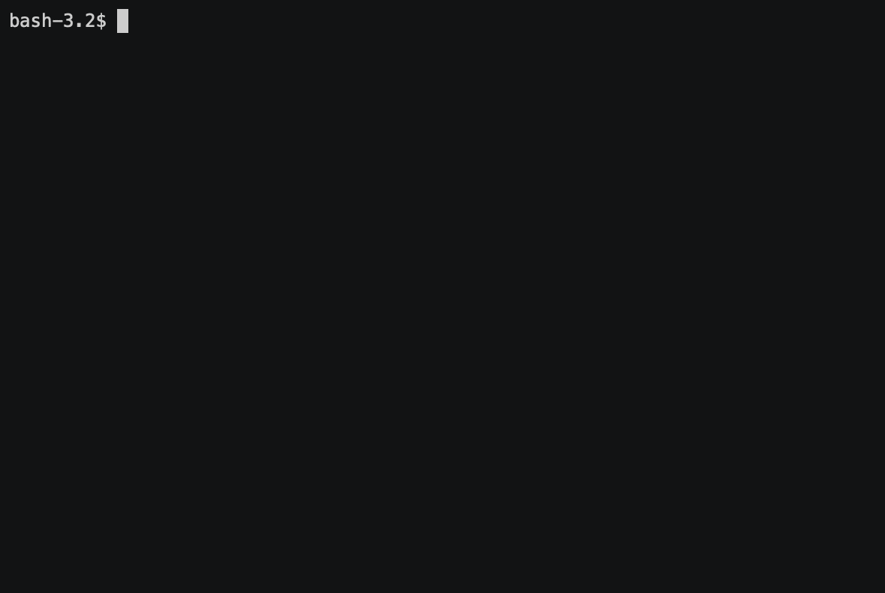

# Hexlet gendiff project

[](https://codeclimate.com/github/AleksandrSerov/frontend-project-lvl2/maintainability)
[](https://codeclimate.com/github/AleksandrSerov/frontend-project-lvl2/test_coverage)
<a href="https://travis-ci.com/AleksandrSerov/frontend-project-lvl2">
</a>

## Installation

```bash
git clone https://github.com/AleksandrSerov/frontend-project-lvl2.git
cd frontend-project-lvl2
make install
```

## Publish package

```bash
make publish
```

## Installation package

```bash
sudo npm link
```

## Scripts

- `make install` - Install dependences
- `make publish` - Publish project
- `make watch` - Start tests in watch mode
- `make test` - Start tests
- `make lint` - Start lint
- `make start` - Start project

## Demo

### Flat configs


